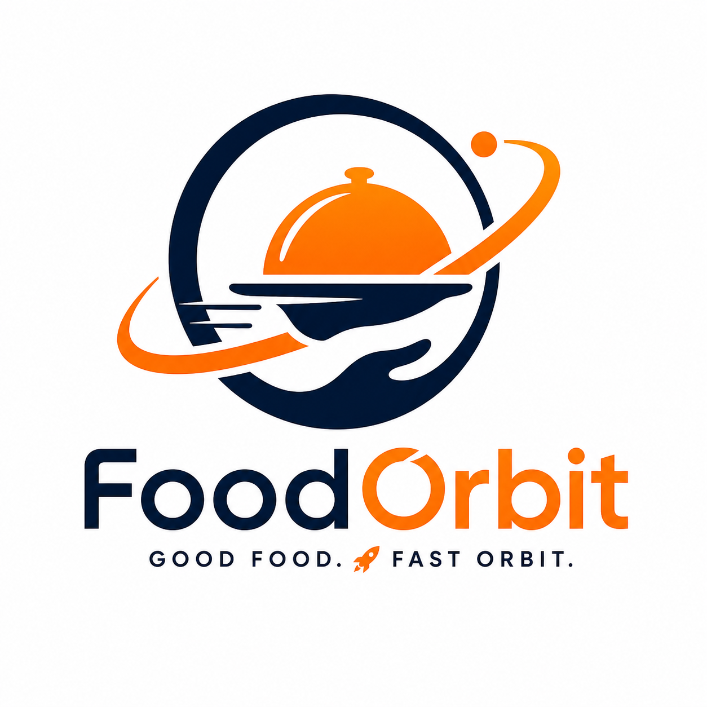

<p align="center">
  
</p>

# 🍔 FoodOrbit

FoodOrbit is a full-featured **food delivery platform** that enables restaurants, customers, and delivery personnel to interact seamlessly in real-time. It supports live order tracking, service-based features, and scalable event-driven architecture.

---

## 🚀 Features

### 🏪 Restaurant Management

* Restaurant registration & profile management
* Menu creation and item categorization
* Inventory & availability control

### 🛒 Real-Time Ordering

* Live order placement and updates
* Order status tracking (pending, preparing, out for delivery, delivered)
* Real-time notifications using event-driven architecture

### 🚚 Delivery System

* Assign delivery personnel dynamically
* Track delivery status
* Support for shared or independent delivery systems

### 👥 User Roles

* Customers
* Restaurant owners
* Delivery personnel
* Admin dashboard (optional/extendable)

### ⚙️ Service-Based Architecture

* Modular backend services
* Event-driven communication with RabbitMQ
* Scalable and maintainable system design

---

## 🛠️ Tech Stack

### Frontend

* React.js
* Modern UI/UX (can integrate Tailwind / ShadCN UI)

### Backend

* Node.js
* Express.js
* TypeScript

### Messaging & Real-Time

* RabbitMQ (for async communication & event queues)

### Others

* REST APIs
* Scalable microservice-friendly structure

---

## 📁 Project Structure (Example)

```
foodorbit/
│
├── client/              # React frontend
├── server/              # Node.js backend (Express + TypeScript)
├── services/            # Microservices / modular services
├── shared/              # Shared utilities/types
├── foodorbitLogo.png    # Project logo
└── README.md
```

---

## 🖼️ Logo

---

## ⚙️ Installation & Setup

### 1️⃣ Clone the repository

```bash
git clone https://github.com/your-username/foodorbit.git
cd foodorbit
```

### 2️⃣ Install dependencies

#### Backend

```bash
cd server
npm install
```

#### Frontend

```bash
cd client
npm install
```

---

### 3️⃣ Environment Variables

Create a `.env` file in the server directory:

```
PORT=5000
RABBITMQ_URL=amqp://localhost
DB_URL=your_database_url
JWT_SECRET=your_secret_key
```

---

### 4️⃣ Run the project

#### Start backend

```bash
npm run dev
```

#### Start frontend

```bash
npm start
```

---

## 🧠 Architecture Overview

* Uses **RabbitMQ** for asynchronous communication between services
* Backend built with **Express + TypeScript** for scalability
* Frontend communicates via REST APIs
* Designed to evolve into **microservices architecture**

---

## 🔄 Real-Time Flow Example

1. Customer places an order
2. Order service publishes event to RabbitMQ
3. Restaurant service receives and processes it
4. Delivery service assigns rider
5. Status updates are pushed back to the client

---

## 📌 Future Improvements

* WebSocket-based live tracking
* Payment gateway integration
* AI-based delivery optimization
* Multi-restaurant marketplace scaling
* Mobile app (React Native)

---

## 🤝 Contributing

Contributions are welcome! Feel free to fork the repo and submit a pull request.

---

## 📄 License

This project is licensed under the MIT License.

---

## 💡 Author

Developed by **FoodOrbit Team**
